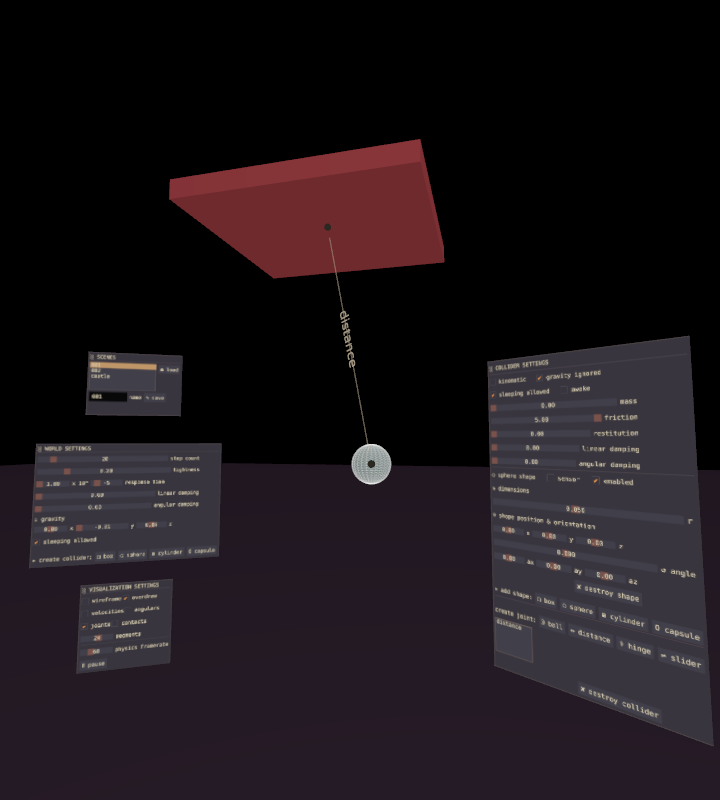
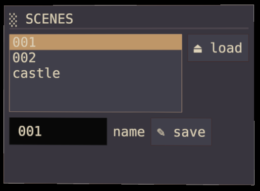
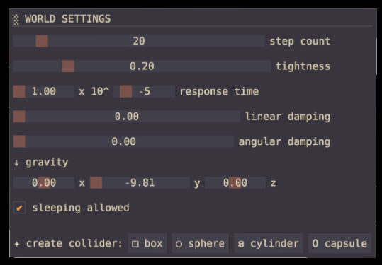
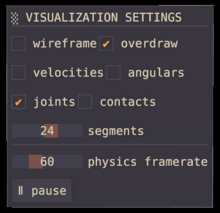
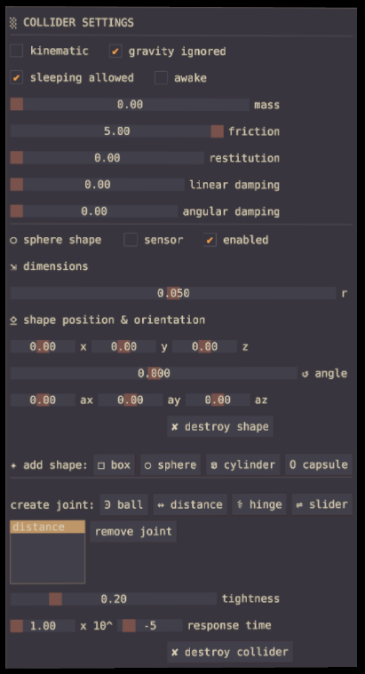

# lovr-phyedit

VR editor for creating and testing the virtual physics simulations. It exposes most of the [LÖVR](https://lovr.org/)'s features for physics world, colliders, shapes and joints, with notable exceptions of tags, mesh shape and terrain shape.

Beware, this is a pre-alpha quality release - it is not well tested and can be prone to crashes. I would welcome any issue reports, feature requests, pull requests or any other feedback.

#### Scenes window

Saving and loading of saved scenes. The files themselves can be found in the save directory:

* Linux: `/home/<user>/.local/share/LOVR/phyedit/`
* Windows: `C:\Users\<user>\AppData\Roaming\LOVR\phyedit\`
* macOS: `/Users/<user>/Library/Application Support/LOVR/phyedit/`

Scene is saved as plain-text serialized Lua, it can be loaded into other projects by using [phywire](https://github.com/jmiskovic/lovr-phywire) library using the "snapshot" feature.

#### Controls

Either hand can operate all the listed commands.

Use Trigger to interact with UI Windows. Point at the collider and use A or X button to select it. Hold the GRIP button and move the hand to push the selected collider around. Use thumbstick while holding the GRIP to rotate it.

#### World settings window

Allows changing the global physics world settings.

Note that damping settings and sleeping-allowed setting only affects newly created colliders and won't have effect on already existing ones (they can still be modified individually).

At the bottom of the window are four buttons for creating new colliders with various initial shapes. They will be placed in front of the camera and will have an initial size which can later be changed in collider window.

#### Visualization settings window

The window allows enabling and disabling various physics visualizations, and controlling the simulation speed. For more information about each setting check the [phywire](https://github.com/jmiskovic/lovr-phywire) library.

The pause button stops the simulation, while the framerate controls the physics update delta time.

#### Collider window

The most complex window is the collider window which operates on the currently selected collider.

First group of settings affects the whole collider. After that is the dynamically expanding list of each shape belonging to the collider, together with its settings. Note that when changing shape position the collider will behave unrealistically if its shapes are not balanced so that the center of mass falls in the collider origin. Achieving this with manual tweaking is not really practical, *needs improvement*.

It is also possible to delete individual shapes. If the last shape is deleted the collider will remain empty (this is not really an issue for the simulation except it won't be possible to re-select such collider). Shapes can be freely added into the same collider until the window becomes too large and unwieldy (*needs improvement*).

At the bottom of the window are physical joint features. To create a collider, click on the button and select the other collider (A or X button). Make sure that "joints" option is selected in the visualization window to be able to see the joints.

Because the joint is a connection between two colliders, the exact same joint will be shown when any of the two colliders is selected. After joint is selected, it can be removed, or its parameters can be modified. Currently it is not possible to modify the anchor points or axes for joints, *needs improvement*.

#### Dependencies

The phyedit leverages these libraries (included in the project).

* [lovr-ui](https://github.com/immortalx74/lovr-ui)
* [serpent](https://github.com/pkulchenko/serpent/)
* [phywire](https://github.com/jmiskovic/lovr-phywire)
